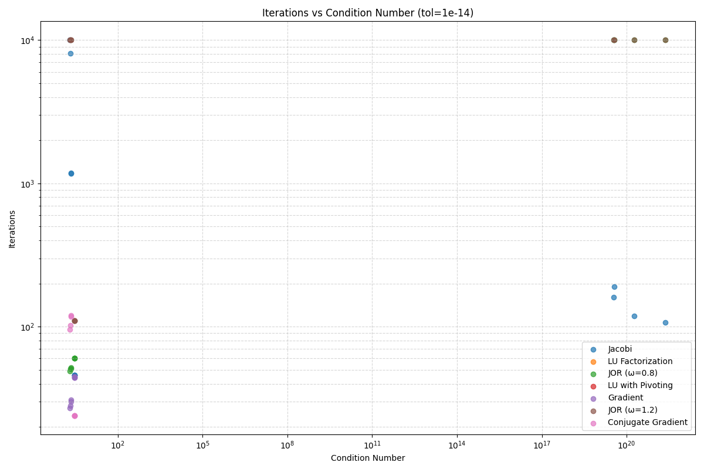
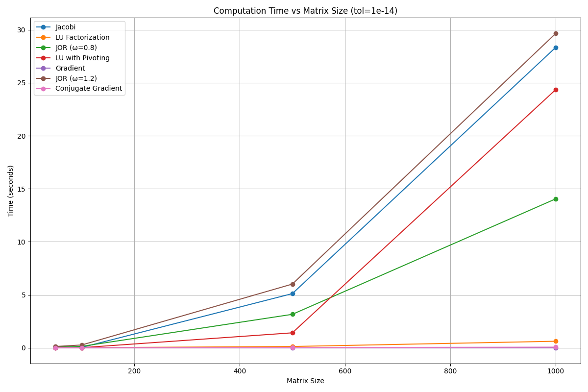
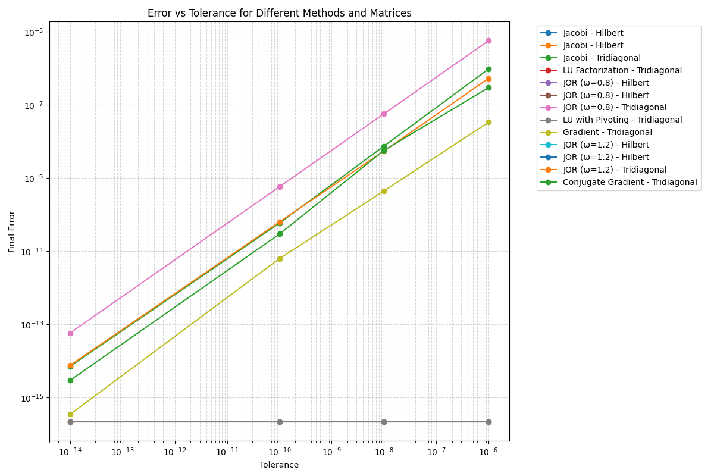

# Comparison of Numerical Methods for Linear Systems

## Methods Compared

This report compares the following numerical methods for solving linear systems Ax = b:

- Jacobi
- LU Factorization
- JOR (ω=0.8)
- LU with Pivoting
- Gradient
- JOR (ω=1.2)
- Conjugate Gradient

## Test Matrices

The methods were tested on the following matrix types:

- Hilbert Matrix (n=50) (avg. condition number: 3.63e+19)
- Hilbert Matrix (n=500) (avg. condition number: 1.83e+20)
- Tridiagonal Matrix (n=1000) (avg. condition number: 3.00e+00)
- Random SPD Matrix (n=1000) (avg. condition number: 2.05e+00)
- Random SPD Matrix (n=100) (avg. condition number: 2.16e+00)
- Tridiagonal Matrix (n=500) (avg. condition number: 3.00e+00)
- Tridiagonal Matrix (n=100) (avg. condition number: 3.00e+00)
- Tridiagonal Matrix (n=50) (avg. condition number: 2.99e+00)
- Random SPD Matrix (n=50) (avg. condition number: 2.24e+00)
- Hilbert Matrix (n=1000) (avg. condition number: 2.36e+21)
- Random SPD Matrix (n=500) (avg. condition number: 2.08e+00)
- Hilbert Matrix (n=100) (avg. condition number: 3.48e+19)

## Performance Analysis

### Convergence Properties

#### Hilbert Matrix (n=50)

| Method | Tolerance | Iterations | Time (s) | Final Error |
|--------|-----------|------------|----------|-------------|
| Jacobi | 1.0e-14 | 191 | 0.004748 | nan |
| Jacobi | 1.0e-10 | 191 | 0.004711 | nan |
| Jacobi | 1.0e-08 | 191 | 0.004810 | nan |
| Jacobi | 1.0e-06 | 191 | 0.004986 | nan |
| JOR (ω=0.8) | 1.0e-14 | 10000 | 0.173149 | nan |
| JOR (ω=0.8) | 1.0e-10 | 10000 | 0.170754 | nan |
| JOR (ω=0.8) | 1.0e-08 | 10000 | 0.170258 | nan |
| JOR (ω=0.8) | 1.0e-06 | 10000 | 0.171280 | nan |
| JOR (ω=1.2) | 1.0e-14 | 10000 | 0.173294 | nan |
| JOR (ω=1.2) | 1.0e-10 | 10000 | 0.170389 | nan |
| JOR (ω=1.2) | 1.0e-08 | 10000 | 0.170163 | nan |
| JOR (ω=1.2) | 1.0e-06 | 10000 | 0.171063 | nan |

#### Hilbert Matrix (n=500)

| Method | Tolerance | Iterations | Time (s) | Final Error |
|--------|-----------|------------|----------|-------------|
| Jacobi | 1.0e-14 | 119 | 0.231169 | nan |
| Jacobi | 1.0e-10 | 119 | 0.222397 | nan |
| Jacobi | 1.0e-08 | 119 | 0.233899 | nan |
| Jacobi | 1.0e-06 | 119 | 0.241414 | nan |
| JOR (ω=0.8) | 1.0e-14 | 10000 | 9.355467 | nan |
| JOR (ω=0.8) | 1.0e-10 | 10000 | 8.650069 | nan |
| JOR (ω=0.8) | 1.0e-08 | 10000 | 9.394791 | nan |
| JOR (ω=0.8) | 1.0e-06 | 10000 | 8.752053 | nan |
| JOR (ω=1.2) | 1.0e-14 | 10000 | 8.673235 | nan |
| JOR (ω=1.2) | 1.0e-10 | 10000 | 9.511565 | nan |
| JOR (ω=1.2) | 1.0e-08 | 10000 | 8.879353 | nan |
| JOR (ω=1.2) | 1.0e-06 | 10000 | 9.129417 | nan |

#### Tridiagonal Matrix (n=1000)

| Method | Tolerance | Iterations | Time (s) | Final Error |
|--------|-----------|------------|----------|-------------|
| Jacobi | 1.0e-14 | 46 | 0.527087 | 7.16e-15 |
| Jacobi | 1.0e-10 | 33 | 0.362214 | 5.82e-11 |
| Jacobi | 1.0e-08 | 26 | 0.273780 | 7.45e-09 |
| Jacobi | 1.0e-06 | 19 | 0.225628 | 9.55e-07 |
| LU Factorization | 1.0e-14 | 0 | 0.693515 | 2.18e-16 |
| LU Factorization | 1.0e-10 | 0 | 0.565267 | 2.18e-16 |
| LU Factorization | 1.0e-08 | 0 | 0.689724 | 2.18e-16 |
| LU Factorization | 1.0e-06 | 0 | 0.522338 | 2.18e-16 |
| JOR (ω=0.8) | 1.0e-14 | 60 | 0.330502 | 5.83e-14 |
| JOR (ω=0.8) | 1.0e-10 | 42 | 0.305677 | 5.75e-10 |
| JOR (ω=0.8) | 1.0e-08 | 33 | 0.196089 | 5.71e-08 |
| JOR (ω=0.8) | 1.0e-06 | 24 | 0.148876 | 5.67e-06 |
| LU with Pivoting | 1.0e-14 | 0 | 24.347612 | 2.18e-16 |
| LU with Pivoting | 1.0e-10 | 0 | 17.500304 | 2.18e-16 |
| LU with Pivoting | 1.0e-08 | 0 | 19.404209 | 2.18e-16 |
| LU with Pivoting | 1.0e-06 | 0 | 22.323668 | 2.18e-16 |
| Gradient | 1.0e-14 | 44 | 0.008342 | 3.48e-16 |
| Gradient | 1.0e-10 | 30 | 0.005709 | 6.24e-12 |
| Gradient | 1.0e-08 | 24 | 0.004670 | 4.46e-10 |
| Gradient | 1.0e-06 | 18 | 0.003614 | 3.34e-08 |
| JOR (ω=1.2) | 1.0e-14 | 110 | 0.555010 | 7.59e-15 |
| JOR (ω=1.2) | 1.0e-10 | 71 | 0.504109 | 6.27e-11 |
| JOR (ω=1.2) | 1.0e-08 | 52 | 0.276158 | 5.48e-09 |
| JOR (ω=1.2) | 1.0e-06 | 33 | 0.170743 | 5.30e-07 |
| Conjugate Gradient | 1.0e-14 | 24 | 0.025454 | 2.96e-15 |
| Conjugate Gradient | 1.0e-10 | 17 | 0.020603 | 2.93e-11 |
| Conjugate Gradient | 1.0e-08 | 13 | 0.013727 | 5.68e-09 |
| Conjugate Gradient | 1.0e-06 | 10 | 0.013735 | 2.95e-07 |

#### Random SPD Matrix (n=1000)

| Method | Tolerance | Iterations | Time (s) | Final Error |
|--------|-----------|------------|----------|-------------|
| Jacobi | 1.0e-14 | 10000 | 83.578634 | 1.05e-08 |
| Jacobi | 1.0e-10 | 10000 | 79.380592 | 1.05e-08 |
| Jacobi | 1.0e-08 | 10000 | 84.809396 | 1.05e-08 |
| Jacobi | 1.0e-06 | 7617 | 71.266576 | 9.99e-07 |
| LU Factorization | 1.0e-14 | 0 | 0.530763 | 8.68e-16 |
| LU Factorization | 1.0e-10 | 0 | 0.529596 | 8.68e-16 |
| LU Factorization | 1.0e-08 | 0 | 0.523454 | 8.68e-16 |
| LU Factorization | 1.0e-06 | 0 | 0.548811 | 8.68e-16 |
| JOR (ω=0.8) | 1.0e-14 | 49 | 0.251304 | 1.42e-08 |
| JOR (ω=0.8) | 1.0e-10 | 32 | 0.179411 | 8.78e-05 |
| JOR (ω=0.8) | 1.0e-08 | 23 | 0.120153 | 8.91e-03 |
| JOR (ω=0.8) | 1.0e-06 | 14 | 0.080427 | 9.04e-01 |
| Gradient | 1.0e-14 | 27 | 0.004660 | 4.65e-13 |
| Gradient | 1.0e-10 | 18 | 0.003103 | 6.14e-09 |
| Gradient | 1.0e-08 | 14 | 0.002395 | 4.62e-07 |
| Gradient | 1.0e-06 | 10 | 0.001880 | 3.53e-05 |
| JOR (ω=1.2) | 1.0e-14 | 10000 | 46.167751 | nan |
| JOR (ω=1.2) | 1.0e-10 | 10000 | 42.314253 | nan |
| JOR (ω=1.2) | 1.0e-08 | 10000 | 42.533136 | nan |
| JOR (ω=1.2) | 1.0e-06 | 10000 | 41.694420 | nan |
| Conjugate Gradient | 1.0e-14 | 96 | 0.087353 | nan |
| Conjugate Gradient | 1.0e-10 | 7 | 0.006136 | 6.19e-11 |
| Conjugate Gradient | 1.0e-08 | 6 | 0.005236 | 4.93e-09 |
| Conjugate Gradient | 1.0e-06 | 5 | 0.004955 | 3.82e-07 |

#### Random SPD Matrix (n=100)

| Method | Tolerance | Iterations | Time (s) | Final Error |
|--------|-----------|------------|----------|-------------|
| Jacobi | 1.0e-14 | 1177 | 0.076715 | 9.78e-15 |
| Jacobi | 1.0e-10 | 849 | 0.055455 | 9.78e-11 |
| Jacobi | 1.0e-08 | 685 | 0.046274 | 9.79e-09 |
| Jacobi | 1.0e-06 | 521 | 0.034136 | 9.79e-07 |
| LU Factorization | 1.0e-14 | 0 | 0.004464 | 2.78e-16 |
| LU Factorization | 1.0e-10 | 0 | 0.004369 | 2.78e-16 |
| LU Factorization | 1.0e-08 | 0 | 0.004429 | 2.78e-16 |
| LU Factorization | 1.0e-06 | 0 | 0.004516 | 2.78e-16 |
| JOR (ω=0.8) | 1.0e-14 | 51 | 0.002273 | 8.16e-11 |
| JOR (ω=0.8) | 1.0e-10 | 34 | 0.001391 | 9.14e-07 |
| JOR (ω=0.8) | 1.0e-08 | 25 | 0.001031 | 1.27e-04 |
| JOR (ω=0.8) | 1.0e-06 | 17 | 0.000740 | 1.02e-02 |
| Gradient | 1.0e-14 | 30 | 0.000154 | 9.20e-14 |
| Gradient | 1.0e-10 | 21 | 0.000111 | 7.81e-10 |
| Gradient | 1.0e-08 | 16 | 0.000085 | 1.29e-07 |
| Gradient | 1.0e-06 | 12 | 0.000065 | 7.64e-06 |
| JOR (ω=1.2) | 1.0e-14 | 10000 | 0.387939 | nan |
| JOR (ω=1.2) | 1.0e-10 | 10000 | 0.387791 | nan |
| JOR (ω=1.2) | 1.0e-08 | 10000 | 0.388937 | nan |
| JOR (ω=1.2) | 1.0e-06 | 10000 | 0.403152 | nan |
| Conjugate Gradient | 1.0e-14 | 120 | 0.001446 | nan |
| Conjugate Gradient | 1.0e-10 | 9 | 0.000121 | 2.31e-11 |
| Conjugate Gradient | 1.0e-08 | 8 | 0.000109 | 6.79e-10 |
| Conjugate Gradient | 1.0e-06 | 6 | 0.000083 | 4.30e-07 |

#### Tridiagonal Matrix (n=500)

| Method | Tolerance | Iterations | Time (s) | Final Error |
|--------|-----------|------------|----------|-------------|
| Jacobi | 1.0e-14 | 46 | 0.093015 | 7.16e-15 |
| Jacobi | 1.0e-10 | 33 | 0.069412 | 5.82e-11 |
| Jacobi | 1.0e-08 | 26 | 0.051115 | 7.45e-09 |
| Jacobi | 1.0e-06 | 19 | 0.037440 | 9.55e-07 |
| LU Factorization | 1.0e-14 | 0 | 0.113220 | 2.14e-16 |
| LU Factorization | 1.0e-10 | 0 | 0.112945 | 2.14e-16 |
| LU Factorization | 1.0e-08 | 0 | 0.110581 | 2.14e-16 |
| LU Factorization | 1.0e-06 | 0 | 0.110368 | 2.14e-16 |
| JOR (ω=0.8) | 1.0e-14 | 60 | 0.057402 | 5.79e-14 |
| JOR (ω=0.8) | 1.0e-10 | 42 | 0.039786 | 5.72e-10 |
| JOR (ω=0.8) | 1.0e-08 | 33 | 0.030956 | 5.68e-08 |
| JOR (ω=0.8) | 1.0e-06 | 24 | 0.022454 | 5.65e-06 |
| LU with Pivoting | 1.0e-14 | 0 | 1.407147 | 2.14e-16 |
| LU with Pivoting | 1.0e-10 | 0 | 1.415735 | 2.14e-16 |
| LU with Pivoting | 1.0e-08 | 0 | 1.404174 | 2.14e-16 |
| LU with Pivoting | 1.0e-06 | 0 | 1.234717 | 2.14e-16 |
| Gradient | 1.0e-14 | 44 | 0.002580 | 6.44e-16 |
| Gradient | 1.0e-10 | 31 | 0.001893 | 5.02e-12 |
| Gradient | 1.0e-08 | 24 | 0.001421 | 7.09e-10 |
| Gradient | 1.0e-06 | 18 | 0.001042 | 5.16e-08 |
| JOR (ω=1.2) | 1.0e-14 | 110 | 0.097957 | 1.07e-14 |
| JOR (ω=1.2) | 1.0e-10 | 71 | 0.064496 | 8.88e-11 |
| JOR (ω=1.2) | 1.0e-08 | 52 | 0.044895 | 7.75e-09 |
| JOR (ω=1.2) | 1.0e-06 | 33 | 0.032520 | 7.49e-07 |
| Conjugate Gradient | 1.0e-14 | 24 | 0.005117 | 4.11e-15 |
| Conjugate Gradient | 1.0e-10 | 17 | 0.003701 | 4.13e-11 |
| Conjugate Gradient | 1.0e-08 | 13 | 0.002789 | 8.02e-09 |
| Conjugate Gradient | 1.0e-06 | 10 | 0.002057 | 4.17e-07 |

#### Tridiagonal Matrix (n=100)

| Method | Tolerance | Iterations | Time (s) | Final Error |
|--------|-----------|------------|----------|-------------|
| Jacobi | 1.0e-14 | 46 | 0.003110 | 7.16e-15 |
| Jacobi | 1.0e-10 | 33 | 0.002184 | 5.82e-11 |
| Jacobi | 1.0e-08 | 26 | 0.001739 | 7.45e-09 |
| Jacobi | 1.0e-06 | 19 | 0.001287 | 9.55e-07 |
| LU Factorization | 1.0e-14 | 0 | 0.004770 | 1.79e-16 |
| LU Factorization | 1.0e-10 | 0 | 0.004482 | 1.79e-16 |
| LU Factorization | 1.0e-08 | 0 | 0.004017 | 1.79e-16 |
| LU Factorization | 1.0e-06 | 0 | 0.004086 | 1.79e-16 |
| JOR (ω=0.8) | 1.0e-14 | 60 | 0.002492 | 5.49e-14 |
| JOR (ω=0.8) | 1.0e-10 | 42 | 0.001942 | 5.48e-10 |
| JOR (ω=0.8) | 1.0e-08 | 33 | 0.001388 | 5.48e-08 |
| JOR (ω=0.8) | 1.0e-06 | 24 | 0.001051 | 5.48e-06 |
| LU with Pivoting | 1.0e-14 | 0 | 0.006139 | 1.79e-16 |
| LU with Pivoting | 1.0e-10 | 0 | 0.006437 | 1.79e-16 |
| LU with Pivoting | 1.0e-08 | 0 | 0.006074 | 1.79e-16 |
| LU with Pivoting | 1.0e-06 | 0 | 0.006492 | 1.79e-16 |
| Gradient | 1.0e-14 | 44 | 0.000222 | 1.91e-15 |
| Gradient | 1.0e-10 | 31 | 0.000153 | 1.73e-11 |
| Gradient | 1.0e-08 | 25 | 0.000129 | 1.17e-09 |
| Gradient | 1.0e-06 | 18 | 0.000098 | 1.63e-07 |
| JOR (ω=1.2) | 1.0e-14 | 110 | 0.004438 | 2.41e-14 |
| JOR (ω=1.2) | 1.0e-10 | 71 | 0.003028 | 2.00e-10 |
| JOR (ω=1.2) | 1.0e-08 | 52 | 0.002133 | 1.74e-08 |
| JOR (ω=1.2) | 1.0e-06 | 33 | 0.001433 | 1.68e-06 |
| Conjugate Gradient | 1.0e-14 | 24 | 0.000314 | 9.00e-15 |
| Conjugate Gradient | 1.0e-10 | 17 | 0.000235 | 9.09e-11 |
| Conjugate Gradient | 1.0e-08 | 14 | 0.000187 | 4.74e-09 |
| Conjugate Gradient | 1.0e-06 | 10 | 0.000121 | 9.21e-07 |

#### Tridiagonal Matrix (n=50)

| Method | Tolerance | Iterations | Time (s) | Final Error |
|--------|-----------|------------|----------|-------------|
| Jacobi | 1.0e-14 | 46 | 0.001125 | 7.11e-15 |
| Jacobi | 1.0e-10 | 33 | 0.000959 | 5.82e-11 |
| Jacobi | 1.0e-08 | 26 | 0.000651 | 7.45e-09 |
| Jacobi | 1.0e-06 | 19 | 0.000483 | 9.55e-07 |
| LU Factorization | 1.0e-14 | 0 | 0.001079 | 1.34e-16 |
| LU Factorization | 1.0e-10 | 0 | 0.001435 | 1.34e-16 |
| LU Factorization | 1.0e-08 | 0 | 0.001070 | 1.34e-16 |
| LU Factorization | 1.0e-06 | 0 | 0.001184 | 1.34e-16 |
| JOR (ω=0.8) | 1.0e-14 | 60 | 0.001050 | 5.08e-14 |
| JOR (ω=0.8) | 1.0e-10 | 42 | 0.000747 | 5.16e-10 |
| JOR (ω=0.8) | 1.0e-08 | 33 | 0.000596 | 5.21e-08 |
| JOR (ω=0.8) | 1.0e-06 | 24 | 0.000445 | 5.26e-06 |
| LU with Pivoting | 1.0e-14 | 0 | 0.001317 | 1.34e-16 |
| LU with Pivoting | 1.0e-10 | 0 | 0.001428 | 1.34e-16 |
| LU with Pivoting | 1.0e-08 | 0 | 0.001548 | 1.34e-16 |
| LU with Pivoting | 1.0e-06 | 0 | 0.001383 | 1.34e-16 |
| Gradient | 1.0e-14 | 45 | 0.000142 | 1.63e-15 |
| Gradient | 1.0e-10 | 32 | 0.000133 | 1.43e-11 |
| Gradient | 1.0e-08 | 25 | 0.000083 | 1.96e-09 |
| Gradient | 1.0e-06 | 18 | 0.000062 | 2.71e-07 |
| JOR (ω=1.2) | 1.0e-14 | 110 | 0.001883 | 3.42e-14 |
| JOR (ω=1.2) | 1.0e-10 | 71 | 0.001613 | 2.84e-10 |
| JOR (ω=1.2) | 1.0e-08 | 52 | 0.000958 | 2.48e-08 |
| JOR (ω=1.2) | 1.0e-06 | 33 | 0.000579 | 2.40e-06 |
| Conjugate Gradient | 1.0e-14 | 24 | 0.000177 | 7.90e-15 |
| Conjugate Gradient | 1.0e-10 | 18 | 0.000157 | 3.18e-11 |
| Conjugate Gradient | 1.0e-08 | 14 | 0.000112 | 6.41e-09 |
| Conjugate Gradient | 1.0e-06 | 11 | 0.000088 | 3.38e-07 |

#### Random SPD Matrix (n=50)

| Method | Tolerance | Iterations | Time (s) | Final Error |
|--------|-----------|------------|----------|-------------|
| Jacobi | 1.0e-14 | 1175 | 0.029697 | 9.85e-15 |
| Jacobi | 1.0e-10 | 848 | 0.021070 | 9.83e-11 |
| Jacobi | 1.0e-08 | 684 | 0.017332 | 9.96e-09 |
| Jacobi | 1.0e-06 | 521 | 0.013206 | 9.81e-07 |
| LU Factorization | 1.0e-14 | 0 | 0.001138 | 1.63e-16 |
| LU Factorization | 1.0e-10 | 0 | 0.001133 | 1.63e-16 |
| LU Factorization | 1.0e-08 | 0 | 0.001169 | 1.63e-16 |
| LU Factorization | 1.0e-06 | 0 | 0.001220 | 1.63e-16 |
| JOR (ω=0.8) | 1.0e-14 | 52 | 0.000912 | 2.36e-11 |
| JOR (ω=0.8) | 1.0e-10 | 35 | 0.000619 | 2.65e-07 |
| JOR (ω=0.8) | 1.0e-08 | 27 | 0.000505 | 2.13e-05 |
| JOR (ω=0.8) | 1.0e-06 | 18 | 0.000349 | 2.97e-03 |
| Gradient | 1.0e-14 | 31 | 0.000120 | 6.88e-14 |
| Gradient | 1.0e-10 | 21 | 0.000082 | 1.21e-09 |
| Gradient | 1.0e-08 | 17 | 0.000073 | 6.19e-08 |
| Gradient | 1.0e-06 | 12 | 0.000048 | 9.13e-06 |
| JOR (ω=1.2) | 1.0e-14 | 10000 | 0.174029 | nan |
| JOR (ω=1.2) | 1.0e-10 | 10000 | 0.172309 | nan |
| JOR (ω=1.2) | 1.0e-08 | 10000 | 0.171726 | nan |
| JOR (ω=1.2) | 1.0e-06 | 10000 | 0.173885 | nan |
| Conjugate Gradient | 1.0e-14 | 118 | 0.001164 | nan |
| Conjugate Gradient | 1.0e-10 | 10 | 0.000090 | 9.79e-12 |
| Conjugate Gradient | 1.0e-08 | 8 | 0.000073 | 3.86e-09 |
| Conjugate Gradient | 1.0e-06 | 7 | 0.000056 | 7.20e-08 |

#### Hilbert Matrix (n=1000)

| Method | Tolerance | Iterations | Time (s) | Final Error |
|--------|-----------|------------|----------|-------------|
| Jacobi | 1.0e-14 | 107 | 0.889329 | nan |
| Jacobi | 1.0e-10 | 107 | 0.918371 | nan |
| Jacobi | 1.0e-08 | 107 | 1.071802 | nan |
| Jacobi | 1.0e-06 | 107 | 0.844953 | nan |
| JOR (ω=0.8) | 1.0e-14 | 10000 | 41.551631 | nan |
| JOR (ω=0.8) | 1.0e-10 | 10000 | 40.659600 | nan |
| JOR (ω=0.8) | 1.0e-08 | 10000 | 42.753308 | nan |
| JOR (ω=0.8) | 1.0e-06 | 10000 | 43.948758 | nan |
| JOR (ω=1.2) | 1.0e-14 | 10000 | 42.218051 | nan |
| JOR (ω=1.2) | 1.0e-10 | 10000 | 41.595112 | nan |
| JOR (ω=1.2) | 1.0e-08 | 10000 | 39.242988 | nan |
| JOR (ω=1.2) | 1.0e-06 | 10000 | 43.163414 | nan |

#### Random SPD Matrix (n=500)

| Method | Tolerance | Iterations | Time (s) | Final Error |
|--------|-----------|------------|----------|-------------|
| Jacobi | 1.0e-14 | 8068 | 14.994578 | 9.99e-15 |
| Jacobi | 1.0e-10 | 5816 | 10.940951 | 9.97e-11 |
| Jacobi | 1.0e-08 | 4689 | 9.030621 | 1.00e-08 |
| Jacobi | 1.0e-06 | 3563 | 6.974179 | 9.99e-07 |
| LU Factorization | 1.0e-14 | 0 | 0.118768 | 5.58e-16 |
| LU Factorization | 1.0e-10 | 0 | 0.114828 | 5.58e-16 |
| LU Factorization | 1.0e-08 | 0 | 0.109675 | 5.58e-16 |
| LU Factorization | 1.0e-06 | 0 | 0.109340 | 5.58e-16 |
| JOR (ω=0.8) | 1.0e-14 | 51 | 0.045043 | 2.19e-09 |
| JOR (ω=0.8) | 1.0e-10 | 33 | 0.035913 | 2.38e-05 |
| JOR (ω=0.8) | 1.0e-08 | 24 | 0.024586 | 2.48e-03 |
| JOR (ω=0.8) | 1.0e-06 | 15 | 0.015363 | 2.58e-01 |
| Gradient | 1.0e-14 | 28 | 0.001593 | 1.95e-13 |
| Gradient | 1.0e-10 | 19 | 0.001153 | 2.40e-09 |
| Gradient | 1.0e-08 | 15 | 0.000948 | 1.74e-07 |
| Gradient | 1.0e-06 | 10 | 0.000626 | 3.88e-05 |
| JOR (ω=1.2) | 1.0e-14 | 10000 | 9.249864 | nan |
| JOR (ω=1.2) | 1.0e-10 | 10000 | 9.157606 | nan |
| JOR (ω=1.2) | 1.0e-08 | 10000 | 9.451210 | nan |
| JOR (ω=1.2) | 1.0e-06 | 10000 | 8.994594 | nan |
| Conjugate Gradient | 1.0e-14 | 102 | 0.021235 | nan |
| Conjugate Gradient | 1.0e-10 | 8 | 0.001867 | 6.08e-12 |
| Conjugate Gradient | 1.0e-08 | 7 | 0.001585 | 3.34e-10 |
| Conjugate Gradient | 1.0e-06 | 5 | 0.001251 | 9.92e-07 |

#### Hilbert Matrix (n=100)

| Method | Tolerance | Iterations | Time (s) | Final Error |
|--------|-----------|------------|----------|-------------|
| Jacobi | 1.0e-14 | 161 | 0.010662 | nan |
| Jacobi | 1.0e-10 | 161 | 0.011597 | nan |
| Jacobi | 1.0e-08 | 161 | 0.011120 | nan |
| Jacobi | 1.0e-06 | 161 | 0.010752 | nan |
| JOR (ω=0.8) | 1.0e-14 | 10000 | 0.388421 | nan |
| JOR (ω=0.8) | 1.0e-10 | 10000 | 0.389896 | nan |
| JOR (ω=0.8) | 1.0e-08 | 10000 | 0.387436 | nan |
| JOR (ω=0.8) | 1.0e-06 | 10000 | 0.388493 | nan |
| JOR (ω=1.2) | 1.0e-14 | 10000 | 0.388651 | nan |
| JOR (ω=1.2) | 1.0e-10 | 10000 | 0.389096 | nan |
| JOR (ω=1.2) | 1.0e-08 | 10000 | 0.388640 | nan |
| JOR (ω=1.2) | 1.0e-06 | 10000 | 0.387531 | nan |

### Effect of Matrix Condition Number

For iterative methods, the number of iterations required typically increases with the condition number of the matrix.

### Computational Efficiency

Methods ranked by average computation time (fastest to slowest):

- Gradient: 0.001481 seconds
- Conjugate Gradient: 0.006917 seconds
- LU Factorization: 0.173367 seconds
- JOR (ω=0.8): 4.358476 seconds
- LU with Pivoting: 5.566774 seconds
- Jacobi: 7.659112 seconds
- JOR (ω=1.2): 8.713261 seconds

### Accuracy Comparison

Methods ranked by average error (most accurate to least accurate):

- Jacobi: nan
- LU Factorization: 3.26e-16
- JOR (ω=0.8): nan
- LU with Pivoting: 1.86e-16
- Gradient: 2.88e-06
- JOR (ω=1.2): nan
- Conjugate Gradient: nan

## Conclusions

- For well-conditioned matrices (like tridiagonal systems), Gradient performs best in terms of speed.
- For ill-conditioned matrices (like Hilbert matrices), Jacobi provides the most accurate results.
- Direct methods (LU decomposition) are generally more reliable but can be slower for large systems.
- Iterative methods can be more efficient for large, sparse systems but may struggle with ill-conditioned problems.
- The Conjugate Gradient method typically converges faster than the standard Gradient method for SPD matrices.
- The choice of relaxation parameter in JOR can significantly affect convergence.

## Visual Analysis

